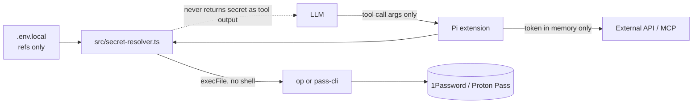
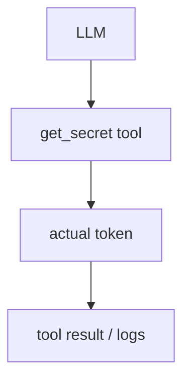

# Extension Secret Management

Shared pattern for Pi extensions that need API tokens without exposing them to model logs.

## Recommended flow



## Do not expose a generic secret tool



Extensions should call the resolver internally. The LLM should never get a tool that returns raw secrets.

## Standard env names

For a service prefix like `LINEAR_MCP`, prefer:

```bash
LINEAR_MCP_SECRET_REF='pass://ExampleVault/pi-linear/API Key'
# or
LINEAR_MCP_SECRET_REF='op://ExampleVault/pi-linear/API Key'
```

Manager-specific names are also supported:

```bash
LINEAR_MCP_PROTON_PASS_REF='pass://ExampleVault/pi-linear/API Key'
LINEAR_MCP_1PASSWORD_REF='op://ExampleVault/pi-linear/API Key'
```

Split Proton Pass lookup is useful when URI parsing gets awkward:

```bash
LINEAR_MCP_PROTON_PASS_VAULT='Personal'
LINEAR_MCP_PROTON_PASS_ITEM='pi-linear'
LINEAR_MCP_PROTON_PASS_FIELD='API Key'
```

## `.env.local` policy

`src/secret-resolver.ts` auto-loads `.env.local` and `.env`, but only imports metadata/config variables:

- `*_REF`
- `*_URI`
- `*_VAULT`
- `*_ITEM`
- `*_FIELD`
- `*_CLI`

It intentionally skips raw secret-looking names:

- `*_TOKEN`
- `*_API_KEY`
- `*_ACCESS_TOKEN`
- `*_PASSWORD`
- `*_SECRET`
- `*_PRIVATE_KEY`

Raw env tokens still work if exported by the shell for CI/dev, but do not put them in `.env.local`.

## How to use from an extension

```ts
import { createSecretResolver } from "../../src/secret-resolver.ts";

const tokenResolver = createSecretResolver({
  serviceName: "Example API",
  envPrefix: "EXAMPLE_API",
  staticEnvNames: ["EXAMPLE_API_TOKEN"],
});

const token = await tokenResolver.resolve();
```

Status commands should only print `tokenResolver.getConfiguredSource()`, never the token or reference value.
